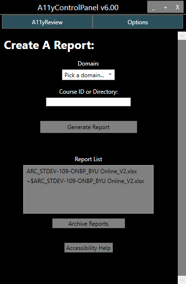

{:refdef: style="text-align: center;"}

{: refdef}

# BYU CE Accessibility Panel

The **Report Generator** is the program we use to automate about 40% of an accessibility audit. After being given correct filepaths and canvas API tokens, this program has logic to scan HTML for many possible accessibility issues we often find in courses. 

[](https://open.vscode.dev/byuceaccessibility/AccessibilityPanel)

# How to install the Accessibility Panel on a work computer

1.	Go to "N:\IS\Quality Assurance\ACCESSIBILITY", open the `AccessibilityPanel` folder, and run the `shortcut.exe` file or the 'shortcut.ps1' file depending on what your computer will allow.
     - Make sure to enter the correct Canvas token for each domain.
2.  After the `shortcut.exe` has finished running, you will find a new shortcut on your screen titled `A11yPanel` and a new folder titled `A11y`. Everything the `shortcut.exe` downloaded is contained on that folder on your desktop.
3.	To run the panel click on the new shortcut titled `A11yPanel`
    - Running the panel will always use the up to date file from the N: Drive
4.	IF you need to change the tokens after running the setup, you will need to manually edit the options file. Navigate to the `Options` tab in the top right of the window. This will open a text editor we can use to input required values.
    - Many of values should already be filled in. In order for the panel to generate a report, you will need to enter in your user specific token for each BYU Canvas domain.
    - For example
      - ```json
        "BYUOnlineCreds":  {
                           "BaseUri":  "https://byu.instructure.com",
                           "Token":  "<YOUR-USER-TOKEN-GOES-HERE>"
                           },
        ```
    - Go to `Canvas API Token` if you are unsure about how to get a Canvas API token for each of the BYU Canvas domains.

## How to find the Course ID

The course ID is found in the URL after the domain and the word "courses" (example: [https://byu.instructure.com/courses/**1026**](https://byu.instructure.com/courses/1026)).

To generate report, place the course ID (**1335** for the example) in the form field and select "Generate Report". Remember to select a domain for the course chosen. **A report will not be generated unless a domain is selected.**


## Quick Tips

### Opening the Report directory in your folder viewer

The Report folder is in a sub folder of the main `AccessibilityTools` folder, specifically `.../AccessibilityTools/ReportGenerators-master/Reports`. A quick way to open this folder is to click on the `Report List` heading above the reports on the Accessibility Panel's user interface.

## Canvas API Token

Before you can create any reports for a canvas course you need an access token. 
1.	Go to the canvas domain you want a token for (such as https://byu.instructure.com/).
2.	Go to `Account` (top left corner).
3.	Go to `Settings`.
4.	Under section called `Approved Integrations` click `New Access Token`.
5.	Set an expiration date or leave it blank for no expiration. Name it whatever you want.
6.	Copy paste generated token into the correct field in the options tab of panel.
7.	If you lose it the token you cannot get it back. Just delete it and create a new one.

# Report Generator

## Introduction

The **Report Generator** is the program we use to automate about 40% of an accessibility audit. After being given correct filepaths and canvas API tokens, this program has logic to scan HTML for many possible accessibility issues we often find in courses. This markdown will give a description of each file used in the process, pseudo code for each file, as well as pseudo code for the whole report generation.

## Review Process

1. Receive Course to review.
2. **Run Report Generator** through the Command Panel GUI.
3. Briefly review generator excel report.
4. Go through course by hand and add findings to the report previously generated.
5. Fix findings and report completed items (update the excel report continuously).
6. Return accessibility review.

## High level Pseudo Code

```
BEGIN
CreateReport() (WPFCommandPanel/GenReportEvents.cs)
    Test conditions of course (WPFCommandPanel/GenReportEvents.cs, CanvasAPI.cs)
        IF conditions not met THEN
            Report not generated, Error Thrown
        ENDIF
    Create data structure (RGeneratorBase.cs)
    FOR each page
        Find accessibility issues (A11yParser.cs)
        Get document information (DocumentParser.cs)
    ENDFOR
    Translate data found to report using excel template (CreateExcelReport.cs)
    Return Report (WPFCommandPanel/GenReportEvents.cs)
END
```

## Project Files and Short Descriptions

**[WPFCommandPanel/GenReportEvent.cs](WPFCommandPanel/GenReportEvents.cs)**
: `CreateReport()` class serves as main function and Initiation of the report generation process. It contains the parent algorithm.

**[A11yParser.cs](ReportGeneratorProj/A11yParser.cs)**
: This files contains the logic for finding the accessibility issues. It is the "meat" of the report generator. A list of automated findings is found in `A11yParser Logic`.

**[DocumentParser.cs](ReportGeneratorProj/DocumentParser.cs)**
: The Document Parser is a class of methods used to parse through documents and gain their information.

**[CreateExcelReport.cs](ReportGeneratorProj/CreateExcelReport.cs)**
: Converts findings from A11yParser, MediaParser, and DocumentParser into rows in the [Excel Accessibility Review Template](CAR%20-%20Accessibility%20Review%20Template.xlsx) (Sheet: Accessibility Review) using a data structure from [RGeneratorBase.cs](source/RGeneratorBase.cs).

**[PanelOptions.cs](ReportGeneratorProj/PanelOptions.cs)**
: File/dir paths & user data

**[CanvasApi.cs](ReportGeneratorProj/CanvasApi.cs)**
: classes to hold canvas info

**[CourseDataStructures.cs](ReportGeneratorProj/CourseDataStructures.cs)**
: translates canvas data into a usable format

**[SeleniumExtensions.cs](ReportGeneratorProj/SeleniumExtensions.cs)**
: Selenium - used to find media data by traversing the HTML.

**[StringExtensions.cs](ReportGeneratorProj/StringExtensions.cs)**
: Helpful String Methods. Splits strings into useful information.

# A11yParser Logic

## Automated Findings

Below is a list of the automated issues found by the report Generator. In the A11yParser file methods for each top level issue is called in the `ProcessContent()` function. The second levels are found using if/else statements in each individual method (i.e. ProcessLinks, ProcessColor, etc.) in the A11yParser class.

- **Links**
  - **Empty Link tag**
  - **Broken Internal Link**
  - **Broken Link**
  - **Invisible Link with no text**
  - **Poor Link Naming**

- **Images**
  - **Title on image**
  - **Empty Alt Text**
  - **Banners with unneccessary alt text**
  - **Insufficient alt text**
  - **Alt text contains filenames**
  - **LaTex in IS HS Course**

- **Paragraphs**
  - **HTML Lists not formatted**
 
- **Table**
  - **Stretched Cells**
  - **No Headers**
  - **No scope attributes**
  - **Empty table**
  - **Complex tables**
 
- **Iframes**
  - **Iframe has no source**
  - **Iframe has no aria-label**
  - **Iframe aria-label in nondescriptive**
  - **Iframe Video has no transcript**

- **BrightcoveVideoHTML**
  - **Brightcove Video has no Transcript**

- **Headers**
  - **Invisible Header**
  - **Headers out of Order**
 
- **VideoTags**
  - **Broken Video Link**
  - **No Video Transcript**
 
- **Flash**
  - **Flash Element is unaccessible**

- **MathJax**
  - **MathJax needs an aria-label**
  - **MathJax label is not descriptive**
 
- **Onclicks**
  - **Onclicks are not accessble**
 
- **AudioElements**
  - **No transcript for Audio Element**

- **Color**
  - **Color Contrast is too low**

This is the current organization of accessibility issues we have so far. That being said, this organizational list is subject to change and we plan on implementing a better organization soon.

# How to setup code editing for this project:

Open up the A11yPanel.sln file from the "N:\IS\Quality Assurance\ACCESSIBILITY\AccessibilityPanel". To push an update, push your changes to the github using git add, git commit, and git push commands in the powershell. Then run the setup.exe file which will pull the latest changes from the github and recompile it on the N: Drive.


# Known Possible Errors

These are known errors that have been detected and solved for the BYU CE Accessibility Panel. For the sake of debugging an error log is created on local machines for each panel. That error log is located at `.../Desktop/AccessibilityTools/A11yPanel/Log.txt`.

The Color Contrast Function is known to occasionally incorrectly mark valid contrast as incorrect
