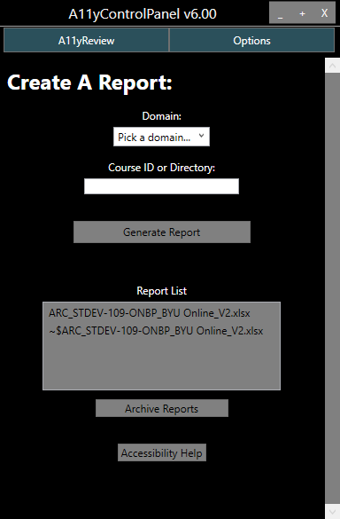

# Accessibility Panel



## Introduction

The **Report Generator** is the program we use to automate about 40% of an accessibility audit. After being given correct filepaths and canvas API tokens, this program has logic to scan HTML for many possible accessibility issues we often find in courses. 

## How to install the Accessibility Panel on a work computer

1.	Go to `M:\DESIGNER\Content Editors·ELTA\Accessibility Assistants\A11y Panel`, open the `AccessibilitySetup` folder, and run the `RunSetUp.exe` file.
     - Make sure to enter Y for everything. You can enter A for yes to all.
2.  After the `RunSetUp.exe` has finished running, you will find a new shortcut on your screen titled `Accessibility Panel` and a new folder titled `AccessibilityTools`. Everything the `RunSetUp.exe` downloaded is contained on that folder on your desktop.
3.	To run the panel click on the new shortcut titled `Accessibility Panel`
    - Running the panel using the shortcut will automatically check for updates upon starting.
4.	Once the panel is running you need to setup the options. Navigate to the `Options` tab in the top right of the window. This will open a text editor we can use to input required values.
    - Many of values should already be filled in. In order for the panel to generate a report, you will need to enter in your user specific token for each BYU Canvas domain.
    - For example
      - ```json
        "BYUOnlineCreds":  {
                           "BaseUri":  "https://byu.instructure.com",
                           "Token":  "<YOUR-USER-TOKEN-GOES-HERE>"
                           }
        ```
    - Go to `Canvas API Token` if you are unsure about how to get a Canvas API token for each of the BYU Canvas domains.

### How to find the Course ID

The course ID is found in the URL after the domain and the word "courses" (example: [https://byuismastercourses.instructure.com/courses/**1335**](https://byuismastercourses.instructure.com/courses/1335)).

To generate report, place the course ID (**1335** for the example) in the form field and select "Generate Report". Remember to select a domain for the course chosen. **A report will not be generated unless a domain is selected.**

### How to find the Correct Directory Path

The panel can make an accessibility report for a folder of HTML files. To create this report you would find the file path to the folder containing the HTML files, place that in the form field and select "Generate Report".

### Quick Tips

#### Opening the Report directory in your folder viewer

The Report folder is in a sub folder of the main `AccessibilityTools` folder, specifically `.../AccessibilityTools/ReportGenerators-master/Reports`. A quick way to open this folder is to click on the `Report List` heading above the reports on the Accessibility Panel's user interface.

### Canvas API Token

Before you can create any reports for a canvas course you need an access token. 
1.	Go to the canvas domain you want a token for (such as https://byu.instructure.com/).
2.	Go to `Account` (top left corner).
3.	Go to `Settings`.
4.	Under section called `Approved Integrations` click `New Access Token`.
5.	Set an expiration date or leave it blank for no expiration. Name it whatever you want.
6.	Copy paste generated token into the correct field in the options tab of panel.
7.	If you lose it the token you cannot get it back. Just delete it and create a new one.